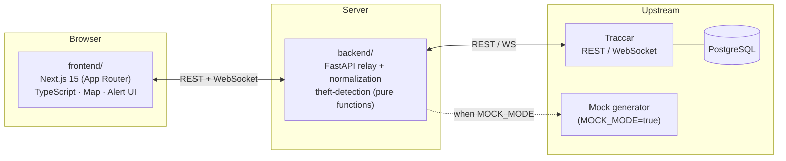

<div align="center">

# 🛰️ FleetGuard

**An open-source, Traccar-powered fleet tracking & anti-theft dashboard.**

A reference implementation for real-time GPS vehicle tracking, geofencing, and
theft detection — built with Next.js, FastAPI, and a fully testable pure-function
detection core.

[](https://github.com/OceansCreative/oceans-fleetguard-demo/actions/workflows/ci.yml)
[](https://github.com/OceansCreative/oceans-fleetguard-demo/actions/workflows/ci.yml)
[](./LICENSE)
[](https://www.typescriptlang.org/)
[](https://www.python.org/)
[](https://nextjs.org/)
[](https://fastapi.tiangolo.com/)

[English](#english) · [日本語](#日本語)

</div>

---

## English

### What is FleetGuard?

FleetGuard is a generic, production-style dashboard that sits in front of a
[Traccar](https://www.traccar.org/) GPS server. It normalizes Traccar's REST
and WebSocket APIs into a clean contract, layers **anti-theft detection** on
top, and presents everything in a live map dashboard.

It ships with a **mock mode** so you can run the entire experience — vehicles
moving in real time, alerts firing — without any GPS hardware or Traccar
instance.

> ℹ️ This repository is a **generic reference implementation**. It contains
> mock data only and no client-specific customization.

### Features

- 🗺️ **Live vector map** — MapLibre GL with a self-contained **offline** style
  (no API key) and a **light / dark / aerial** basemap switcher; vehicle
  positions stream in over WebSocket with auto-reconnect.
- 🚗 **Vehicle list & detail panel** — status, speed, ignition, last update, and
  the selected vehicle's geofence drawn on the map.
- 🚨 **Anti-theft detection** — implemented as pure functions for easy testing:
  - Geofence breach
  - Movement outside business / off-hours
  - Movement while ignition is OFF
  - Abnormal speed / heading
  - GPS signal lost / stale position (possible jamming or tampering)
- 🔔 **Alerts** — surfaced in the dashboard the moment a rule trips, with an
  `/api/alerts/history` log and an opt-in **webhook** on CRITICAL alerts
  (Slack / Discord / any receiver).
- 🔐 **Auth & hardening** (all opt-in, off by default) — shared **API key** on
  `/api` + `/ws`, a **user login** gate (signed session tokens), per-IP **rate
  limiting**, and tightened CORS.
- 🌐 **Bilingual UI** — EN / 日本語 toggle (i18n), browser-detected and
  persisted.
- 📈 **Observability** — structured (JSON) logging with request IDs, a `/ready`
  readiness probe, plus CI, Dependabot, and CodeQL.
- 🧪 **Mock mode** — simulated vehicles around Matsue / Yasugi / Yonago, toggled
  by an environment variable.

### Architecture



| Layer        | Stack                                                        |
| ------------ | ------------------------------------------------------------ |
| `frontend/`  | Next.js 15 (App Router), TypeScript (strict), MapLibre GL (vector) |
| `backend/`   | FastAPI (Python 3.12), pure-function theft detection         |
| `infra/`     | docker-compose: Traccar + PostgreSQL + backend + frontend    |

### Quick start

```bash
# 1. Clone and configure
git clone https://github.com/OceansCreative/oceans-fleetguard-demo.git
cd oceans-fleetguard-demo
cp .env.example .env        # mock mode is enabled by default

# 2. Bring up the full stack (Traccar + Postgres + backend + frontend)
docker compose -f infra/docker-compose.yml up

# 3. Open the dashboard
open http://localhost:3000
```

With `MOCK_MODE=true` (the default) you'll immediately see simulated vehicles
moving around the Matsue area — no Traccar account required.

### Project status

🚧 **Early development.** The roadmap is delivered in small, reviewed pull
requests. See the [issues](https://github.com/OceansCreative/oceans-fleetguard-demo/issues)
for what's planned and in progress, and [CHANGELOG.md](./CHANGELOG.md) for what
has landed.

### Screenshots

The live dashboard — fleet list, real-time map with the selected vehicle's
geofence, and the anti-theft alert feed. A light / dark / aerial basemap
switcher is built in.

| Light | Dark |
| --- | --- |
|  |  |

### Deployment

See [docs/DEPLOYMENT.md](./docs/DEPLOYMENT.md) for the production deployment &
hardening guide: environment setup, authentication, CORS, TLS termination,
notifications, basemap providers, and a hardening checklist.

### Contributing

Contributions are welcome! Please read [CONTRIBUTING.md](./CONTRIBUTING.md) for
the branch / PR / review workflow and local development setup.

### License

[MIT](./LICENSE)

---

## 日本語

### FleetGuard とは

FleetGuard は、[Traccar](https://www.traccar.org/) GPS サーバーの前段に置く
汎用的な車両追跡・**盗難対策**ダッシュボードの参照実装です。Traccar の REST /
WebSocket API を整形して扱いやすい形に正規化し、その上に盗難検知ロジックを重ね、
ライブ地図ダッシュボードとして提供します。

**mock モード**を同梱しているため、GPS 機器や Traccar インスタンスが無くても、
車両がリアルタイムに動き・アラートが発火する一連の体験をそのまま動かせます。

> ℹ️ 本リポジトリは**汎用リファレンス実装**です。mock データのみを含み、特定
> クライアント固有のカスタマイズは含みません。

### 機能

- 🗺️ **ライブ・ベクター地図** — MapLibre GL。キー不要の**オフライン**スタイルを
  同梱し、**明 / 暗 / 航空写真**の基図切替に対応。車両位置は WebSocket で
  ストリーミング更新（自動再接続）
- 🚗 **車両一覧・詳細パネル** — 状態 / 速度 / イグニッション / 最終更新、選択車両の
  ジオフェンスを地図に描画
- 🚨 **盗難検知** — テスト容易な pure function として実装：
  - ジオフェンス逸脱
  - 営業 / 在宅時間外の移動
  - イグニッション OFF 中の移動
  - 速度・進路の異常
  - GPS ロスト / 測位停止（ジャミング・タンパリング疑い）
- 🔔 **アラート** — 判定成立の瞬間に表示。`/api/alerts/history` で履歴取得、
  CRITICAL 時の **Webhook**（Slack / Discord など）にオプトインで対応
- 🔐 **認証・堅牢化**（すべて opt-in・既定 OFF） — `/api`・`/ws` の共有 **API
  キー**、**ユーザーログイン**（署名付きセッション）、IP 単位の**レート制限**、
  CORS 厳格化
- 🌐 **多言語 UI** — EN / 日本語 トグル（i18n）。ブラウザ判定＋永続化
- 📈 **可観測性** — request-id 付き構造化（JSON）ログ、`/ready` レディネス、
  CI・Dependabot・CodeQL
- 🧪 **mock モード** — 松江・安来・米子周辺で動く擬似車両を環境変数で切替

### アーキテクチャ

上記の図を参照してください（`frontend/` ↔ `backend/` ↔ Traccar）。

| レイヤ       | 技術スタック                                                   |
| ------------ | -------------------------------------------------------------- |
| `frontend/`  | Next.js 15 (App Router) / TypeScript(strict) / MapLibre GL（ベクター） |
| `backend/`   | FastAPI (Python 3.12) / pure function による盗難検知           |
| `infra/`     | docker-compose: Traccar + PostgreSQL + backend + frontend      |

### クイックスタート

```bash
cp .env.example .env        # 既定で mock モードが有効
docker compose -f infra/docker-compose.yml up
# http://localhost:3000 を開く
```

### ステータス

🚧 **初期開発中**。ロードマップは小さくレビュー済みの PR 単位で進めます。
これまでに入った変更は [CHANGELOG.md](./CHANGELOG.md) を参照してください。

### スクリーンショット

ライブダッシュボード（車両一覧・選択車両のジオフェンス付きリアルタイム地図・
盗難アラート）。地図は明 / 暗 / 航空写真の切替に対応しています。

| ライト | ダーク |
| --- | --- |
|  |  |

### デプロイ

本番環境へのデプロイと堅牢化の手順（環境変数の設定・認証・CORS・TLS 終端・
通知・基図プロバイダ・セキュリティチェックリスト）は
[docs/DEPLOYMENT.md](./docs/DEPLOYMENT.md) を参照してください。

### コントリビュート

[CONTRIBUTING.md](./CONTRIBUTING.md) を参照してください。

### ライセンス

[MIT](./LICENSE)

---

## Maintainer setup TODO

> These are one-time manual steps to be performed in the GitHub UI (not done
> automatically by code).

- [ ] **About → Description**: e.g. _"Open-source Traccar-powered fleet
      tracking & anti-theft dashboard (Next.js + FastAPI)."_
- [ ] **About → Topics**: `traccar`, `gps-tracking`, `fleet-management`,
      `nextjs`, `fastapi`, `typescript`, `python`
- [ ] **Branch protection** on the default branch: require PR review + green CI.
- [ ] **Secrets**: register Traccar credentials and any deploy tokens (never
      commit them — use `.env` locally / GitHub Secrets in CI).
- [ ] **Deploy**: connect Vercel (frontend) and provision a VPS for
      Traccar + backend.
